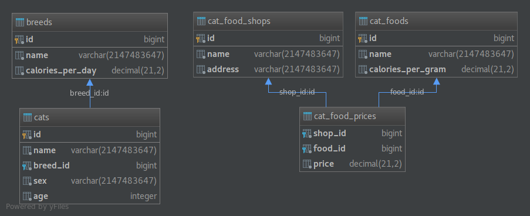

# Slick-Cats-workshop
## Workshop for SphereIT 2018 conference
## *Prepared by Bartosz Radzyński and Szymon Tracz*

## Introduction

Basic purpose of this workshop is to try out and learn
how to use Slick - functional relational mapping library made by Lightbend 
with combination of Cats Lightweight, modular, and extensible library for functional programming.
During this workshop you will be able to get some practical 
knowledge of how to manage dirty database operations in a clean and elegant 
approach using functional programming. Workshop is aimed at beginners starting their 
journey with Scala willing to know how to create elegant persistence 
layer in their applications.

## What to do

This workshop consists of presentation in which some basic concepts
of both slick and cats are explained and series of exercises
located in this repository. All exercises consists of methods and
that user is supposed to implement and tests for them to verify 
if they were written correctly. Exercises are located in test.scala.exercises package.

## Presentation
http://bartosz822.github.io/slick-cats-workshop-presentation

## Basic project setup 
* clone repository
* open sbt in root directory of project and wait for dependencies to be downloaded
* make sure everything compiles
* type `test` in sbt console (all tests should fail)
* follow comments and implements all workshop methods

## Project setup for IntelliJ
*Recommended IntelliJ version 2018.1 or higher*
* clone repository
* open project as an sbt project and wait for sbt to download all dependencies
* make sure everything compiles
* click with left click on exercises package and select `Run all ScalaTests...` (they should all fail)
* follow comments and implements all workshop methods

## Db
This workshop uses in memory H2 database as data source
### Db Schema:

